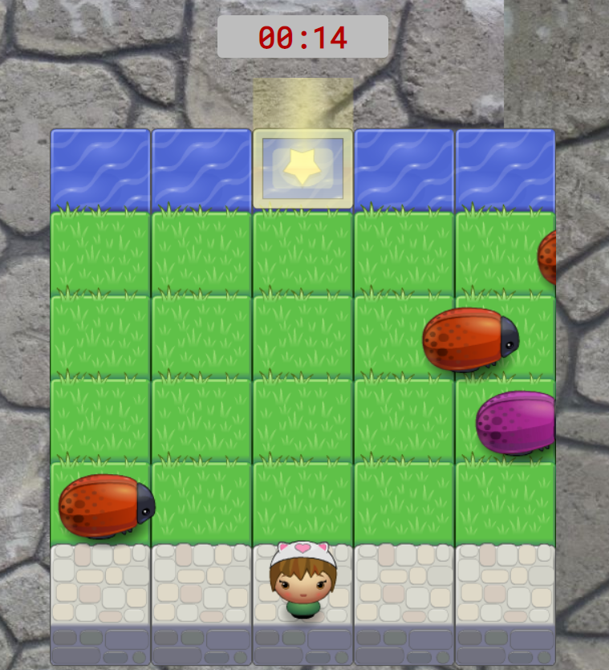

# Frogger clone

A clone of Frogger, the classic arcade game.

## How to play

The player has to reach the star at the top of the board without leaning against the bugs. 
If you arrive at the star it will change place until you get 5 stars. Then, you won the game!

You control the character using the arrow keys.

If you lean on bugs or fall into the water, you will return to the beginning. 

Each star takes the level of the game increases.

Play the game on: https://raphaellibellini.github.io/frontend-nanodegree-arcade-game/

## Screenshot

